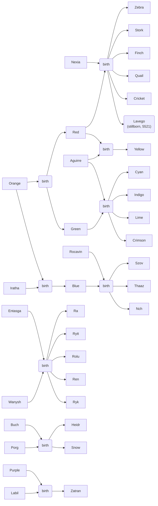

# Family Trees

Parent-child relationships within the colony.  Strictly about biological parents and children for tracking blood relations.

Name candidates for Orange's line
- Teal
- Gold
- Silver
- Sienna
- Violet
- Pearl
- Amber
- Crimson
- Olive

